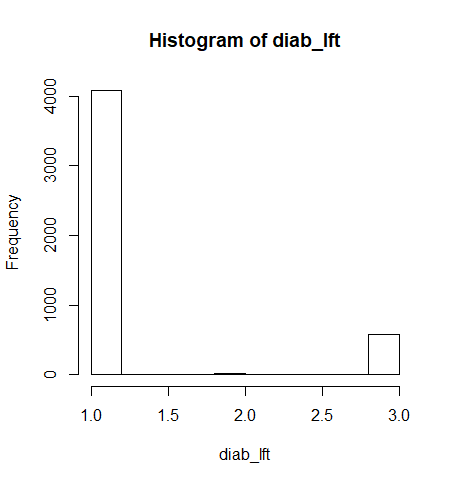

# Data Project
This document includes the answers to the questions in data project along with the R code

## Read Data
```R
mydata <- read.csv("NHANES1.csv")
attach(mydata)
```

## Q1. a
The important characteristics of the NAHNES study are:
* Purpose of the study is assess the health and nutritional status of adults and children in the United States
* Population is sampled with four stage stratified probability cluster sample. This means that selected sample is not representative of the US population.
* Dataset used for this project is based on 2011-12 survey

## Q1. b
Major categories in the dataset include:
* Demographics
* Health History
* Life Style
* Lab Results

## Q2. a
A huge number of participants have age given as 80. This may indicate that 80 was used as a cutoff and age above 80 is coded as 80 as well.


This can be resolved by coding lower ages into categories as well
```R
mydata$agecat[age >=18 & age <=34] <- "18-34"
mydata$agecat[age >=35 & age <=49] <- "35-49"
mydata$agecat[age >=50 & age <=64] <- "50-64"
mydata$agecat[age >=65 & age <=79] <- "65-79"
mydata$agecat[age >=80] <- "80 or higher"
mydata$agecat <- as.factor(mydata$agecat)
detach(mydata)
plot(mydata$agecat)
attach(mydata)
```


## Q2. b
```R
mydata$martlst[martlst==77] <- NA
mydata$martlst[martlst==99] <- NA
detach(mydata)
attach(mydata)
```

## Q2. c
```R
hist(srhgnrl)
median(srhgnrl,na.rm=T)
```

## Q3. a
```R
hist(mydata$diab_lft)
```



In the dataset, dieabetes is coded as None, Prediabetes and Diabetes. Since there are very few samples for prediabetes, it is merged into diabetes category.
```R
mydata$diab_lft[diab_lft>=2] <- 2
mydata$diab_lft[diab_lft==1] <- 'non-diabetes'
mydata$diab_lft[diab_lft==2] <- 'diabetes'
detach(mydata)
attach(mydata)
```
Calculating confidence interval for diabetes:
```R
n = length(diab_lft[!is.na(diab_lft)])
k = sum(diab_lft=='diabetes',na.rm = T)
pbar = k/n
SE = sqrt(pbar * (1 - pbar)/n); SE  # standard error
E = qnorm(.975) * SE; E              # margin of error 
# 0.009569098
pbar + c(-E, E) 
# 0.1187344 0.1378726
```
At 95% confidence level, 11.9-13.8% of people have diabetes and the margin of error is 0.9%.

## Q3. b
Using chisquare test:
```R
xt <- xtabs(~diab_lft+ethnic,data = mydata)
chisq.test(xt)
#data:  xt
#X-squared = 36.054, df = 3, p-value = 7.296e-08
```
Results: p-value (7.296e-08) is much less than 0.05. 
This means diabetes has a strong correlation with ethnicity

## Q4. a
```R
mydata$hrsworked_prvwk[hrsworked_prvwk==77777] <- NA
mydata$hrsworked_prvwk[hrsworked_prvwk==99999] <- NA
detach(mydata)
attach(mydata)
```

## Q4. b
```R
mydata$hrsworked_prvwk[hrsworked_prvwk<40] <- '< 40'
mydata$hrsworked_prvwk[hrsworked_prvwk>=40] <- '>= 40'
mydata$hrsworked_prvwk <- as.factor(mydata$hrsworked_prvwk)
detach(mydata)
attach(mydata)
```

## Q4. c
```R
xt <- xtabs(~srhgnrl+hrsworked_prvwk,data = mydata)
mosaicplot(xt,main = NA)
```


Looking at the plot, the two variables seem to be independent of each other

## Q4. d
```R
chisq.test(xt)
```
p-value is 0.517, which is greater than 0.05. Null hypothesis that self-rated health and hours worked per week are independent is not rejected

## Q5. a
```R
hist(hg[male])
hist(hg[!male])
```


## Q5. b
Using t-test:
```R
xt <- xtabs(~hg+male, data=mydata)
chisq.test(xt)

#	Pearson's Chi-squared test
#
#data:  xt
#X-squared = 437.57, df = 447, p-value = 0.6161
```
p-value is 0.6161, which is greater than 0.05. so the relation between blood mercury level and gender is not significant. Testing the same with non-parametric test:
```R
wilcox.test(hg~male)
#Wilcoxon rank sum test with continuity correction
#
#data:  hg by male
#W = 2551800, p-value = 0.7813
#alternative hypothesis: true location shift is not equal to 0
```
p-value is 0.7813

## Q6. a
```R
summary(lm(hdl~bmi))
# Call:
#   lm(formula = hdl ~ bmi)
# 
# Residuals:
#   Min       1Q   Median       3Q      Max 
# -1.02469 -0.25238 -0.05239  0.19820  3.14070 
# 
# Coefficients:
#   Estimate Std. Error t value Pr(>|t|)    
# (Intercept)  1.7938194  0.0237108   75.65   <2e-16 ***
#   bmi         -0.0153809  0.0008049  -19.11   <2e-16 ***
#   ---
#   Signif. codes:  0 ‘***’ 0.001 ‘**’ 0.01 ‘*’ 0.05 ‘.’ 0.1 ‘ ’ 1
# 
# Residual standard error: 0.3642 on 4364 degrees of freedom
# (634 observations deleted due to missingness)
# Multiple R-squared:  0.07721,	Adjusted R-squared:  0.077 
# F-statistic: 365.2 on 1 and 4364 DF,  p-value: < 2.2e-16
```

p-value shows that relationship is highly significant. looking at R-squared value (0.077), it seems that model is not fitting well. This means that alot of variation in mercury level is not explained bz bmi


## Q6. b
```R
center_bmi = bmi-mean(bmi,na.rm = T)
summary(lm(hdl~center_bmi+agecat))
# Call:
#   lm(formula = hdl ~ center_bmi + agecat)
# 
# Residuals:
#   Min       1Q   Median       3Q      Max 
# -0.98163 -0.25095 -0.04798  0.19679  3.10515 
# 
# Coefficients:
#   Estimate Std. Error t value Pr(>|t|)    
# (Intercept)         1.3104663  0.0099651 131.506  < 2e-16 ***
#   center_bmi         -0.0157472  0.0008104 -19.430  < 2e-16 ***
#   agecat35-49         0.0300396  0.0150917   1.990  0.04660 *  
#   agecat50-64         0.0784924  0.0148209   5.296 1.24e-07 ***
#   agecat65-79         0.0813357  0.0175056   4.646 3.48e-06 ***
#   agecat80 or higher  0.0861655  0.0252214   3.416  0.00064 ***
#   ---
#   Signif. codes:  0 '***' 0.001 '**' 0.01 '*' 0.05 '.' 0.1 ' ' 1
# 
# Residual standard error: 0.3627 on 4360 degrees of freedom
# (634 observations deleted due to missingness)
# Multiple R-squared:  0.08583,	Adjusted R-squared:  0.08478 
# F-statistic: 81.87 on 5 and 4360 DF,  p-value: < 2.2e-16
```
Even after adjusting for age, bmi has a significant relevance to hdl, althouth the coefficient changes a bit. For each unit increase in bmi, hdl is obsered to decrease by ~0.015. Intercept indicates the mean value of hdl for the mean value of bmi (when ignoring age adjustment).


## Q7. a
```R
n = length(cancer_ever[!is.na(cancer_ever)])
k = sum(cancer_ever,na.rm = T)
pbar = k/n
SE = sqrt(pbar * (1 - pbar)/n); SE  # standard error
E = qnorm(.975) * SE; E              # margin of error 
# 0.008068046
pbar + c(-E, E) 
# 0.07984404 0.09598013
```

At 95% confidence level, 8-9.6% of people are diagnosed with cancer during their life and the margin of error is 0.8%.

## Q7. b
```R
cancer_workpolut = cancer_ever[workpollut&!is.na(workpollut)]
n = length(cancer_workpolut[!is.na(cancer_workpolut)])
pbar = mean(cancer_workpolut,na.rm = T)
SE = sqrt(pbar * (1 - pbar)/n); SE  # standard error
E = qnorm(.975) * SE; E              # margin of error 
# 0.008068046
pbar + c(-E, E) 
# 0.06450430 0.08684203
```
At 95% CI, 6.5-8.7% of people exposed to polutants at work are diagnosed with cancer during their life and the margin of error is 1.1%.

```R
cancer_noworkpolut = cancer_ever[!workpollut&!is.na(workpollut)]
n = length(cancer_noworkpolut[!is.na(cancer_noworkpolut)])
pbar = mean(cancer_noworkpolut,na.rm = T)
SE = sqrt(pbar * (1 - pbar)/n); SE  # standard error
E = qnorm(.975) * SE; E              # margin of error 
# 0.008068046
pbar + c(-E, E) 
# 0.05768499 0.07963723
```
At 95% CI, 5.8-8% of people not exposed to polutants at work are diagnosed with cancer during their life and the margin of error is 1.1%. 

Since CI of the means of two groups overlap, the difference is not significant. It can be further proved using chisqq test
```R
xt <- xtabs(~workpollut+cancer_ever,data = mydata)
chisq.test(xt)
# Pearson's Chi-squared test with Yates' continuity correction
# 
# data:  xt
# X-squared = 0.66719, df = 1, p-value = 0.414
```
p-value is greater than 0.414. so the difference in cancer prevalence between the two groups is not significant

## Q7. c
```R
summary(glm(cancer_ever~workpollut+agecat))

# Call:
#   glm(formula = cancer_ever ~ workpollut + agecat)
# 
# Deviance Residuals: 
#   Min        1Q    Median        3Q       Max  
# -0.20132  -0.09401  -0.03940  -0.01437   0.99232  
# 
# Coefficients:
#   Estimate Std. Error t value Pr(>|t|)    
# (Intercept)    0.007681   0.008309   0.924   0.3553    
# workpollutTRUE 0.006694   0.007752   0.864   0.3879    
# agecat35-49    0.025024   0.010509   2.381   0.0173 *  
#   agecat50-64    0.079638   0.010299   7.733 1.31e-14 ***
#   agecat65-79    0.186950   0.011916  15.689  < 2e-16 ***
#   ---
#   Signif. codes:  0 ‘***’ 0.001 ‘**’ 0.01 ‘*’ 0.05 ‘.’ 0.1 ‘ ’ 1
# 
# (Dispersion parameter for gaussian family taken to be 0.06292746)
# 
# Null deviance: 281.10  on 4192  degrees of freedom
# Residual deviance: 263.54  on 4188  degrees of freedom
# (807 observations deleted due to missingness)
# AIC: 309.33
# 
# Number of Fisher Scoring iterations: 2
```
